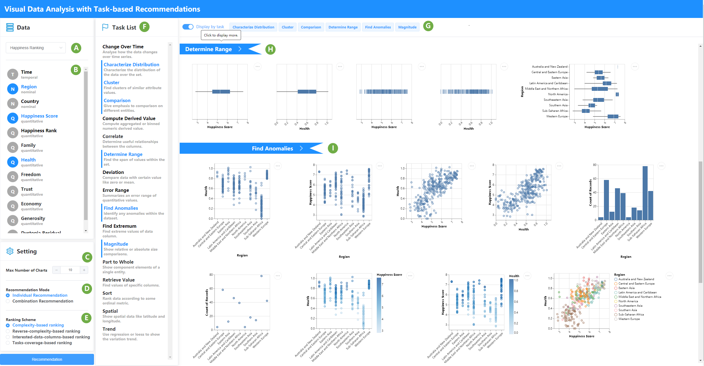

# Visual Data Analysis with Task-based Recommendations
TaskVis is a task-oriented visualization recommendation system. This repository presents the demo of TaskVis. The interface of the system is as follows:
<br>



## backend
* Python：3.7. The java environment is required, and the JAVA_HOME environment variable should be configured.
* [Clingo](https://github.com/potassco/clingo/releases): conda run `conda install -c potassco clingo`. MacOS run `brew install clingo`.
* Packages：run `pip install -r requirements.txt` or `conda install --file requirements.txt`
* Run the command to start the backend service `python .\waitress_server.py`
* The rule base is in `.\backend\visrec\asps`

## frontend
Run the following commands：

```sh
npm install
yarn install
yarn start
```

A series of possible problems：

1. If the vega-embed error occurs during `yarn start`, the error information is as follows:

   ```
   | mark
   | awrap
   | async
   ...
   ```

   Find the code block of the package that reported the error and delete `async`.

 2. Next, if you have problems like the following again

    ```
    You may need an appropriate loader to handle this file type.
    |
    |   if (item.stroke && item.strokeOpacity !== 0 || item.fill && item.fillOpacity
     !== 0) {
    |     return { ...item,
    |       strokeOpacity: 1,
    |       stroke: '#000',
    ...
    ```

    Find the code block of the package that reported the error and modify `...item`=>`item`
